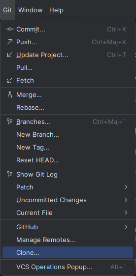
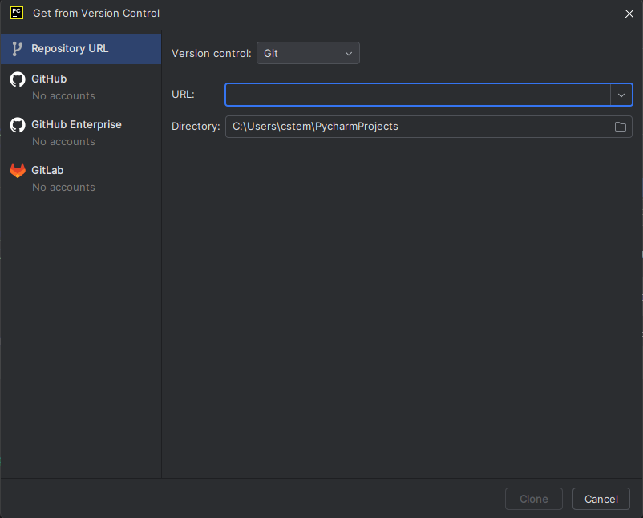

# Développez une application Web en utilisant Django

Developper une application web permettant à une communauté d'utilisateurs
de consulter ou de solliciter une critique de livres à la demande

# Installation
# Cloner un projet distant avec Git dans PyCharm

Ce guide explique comment utiliser l'outil Git intégré de PyCharm pour cloner un projet distant.

---

## Étapes

1. **Allez dans l'onglet Git :**  
   - Cliquez sur **VCS** dans la barre supérieure de PyCharm.  
   - Sélectionnez **Get from Version Control...**. **Ou selectionnez l'onglet GIT et clone dans le menu déroulant**  

   

2. **Saisissez l'URL du dépôt distant :**  
   - Dans la fenêtre qui s'affiche, entrez l'URL suivante :  
     ```
     https://github.com/Saurelien/project_9.git
     ```

   

3. **Choisissez un répertoire local :**  
   - Dans le champ **Directory**, sélectionnez ou saisissez le chemin où vous souhaitez cloner le projet :  
     Exemple : `C:\Users\cstem\PycharmProjects_9_clone_local`.

4. **Cliquez sur le bouton Clone :**  
   - Une fenêtre contextuelle peut apparaître, demandant si vous souhaitez ouvrir le projet dans une nouvelle fenêtre ou dans la fenêtre existante.  
   - Choisissez l'option qui convient le mieux à votre flux de travail.

5. **Configurer le projet après le clonage :**  
   - Une fois le clonage terminé, configurez le projet pour l'utiliser localement :  
     - Sélectionnez la **version de l'interpréteur** Python.  
     - Créez un **environnement virtuel** pour isoler les dépendances.  
     - Installez les **dépendances nécessaires** (par exemple, via `pip install -r requirements.txt`).
     - Mais ces processus devraient ce faire automatiquement en validant le chemin de l'env virtuel, la version de l'interpreteur et le fichier d'installation des dépendances


---
  ### Autre Option:
   - ## Clonez le dépôt:
     `git clone https://github.com/Saurelien/project_9.git`
   - ## Accédez au répertoire du projet :
    - Utilisez la commande cd pour accéder au répertoire du projet que vous venez de cloner :
    ' cd nom_du_projet '
   - ## Créez et activez un environnement virtuel :
     `python -m venv venv`
     - ## Activez ensuite l'environnement virtuel :
       Sur Windows :
     `venv\Scripts\activate`
     Sur macOS et Linux :
     `source venv/bin/activate`
   - ## Installez les dépendances.
    'Si le projet a des dépendances listées dans un fichier requirements.txt, installez-les en utilisant la commande suivante
    ` pip install -r requirements.txt `

1. # Fonctionnalités

- ## Ce projet permet:
- ### En tant qu'invité de s'inscire et se connecter
- ### S'abonner aux utilisateur ou se désabonner
- ### Afficher les utilisateurs suivis et abonnés
- ### Créer un ticket pour demander des avis sur un Livre\ Article
- ### De créer des critiques en réponse à un ticket d'un utilisateur suivi
- ### De créer une critique pour un ticket 
- ### D'avoir accès au panel administrateur " Si l'utilisateur est un super user "
- ### Se deconnecter

2. # Les utilisateurs test:

- ### cstem, "super user" mot de passe: " r1a2i3n4 "
- ### toto, mot de passe: " r1a2i3n4 "
- ### gilbert, mot de passe: " r1a2i3n4 "
- ### zoe1987, mot de passe: " r1a2i3n4 " 

3. # Exécutez le projet 
4. ## en utilisant la commande `python manage.py runserver`.
5. ## Cela devrait démarrer le serveur de developpement local: http://127.0.0.1:8000/
